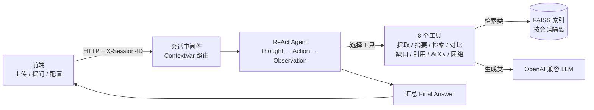
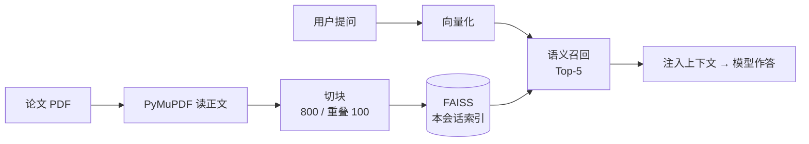

# 论文研究 Agent · 学术论文智能研究助手

一个基于 FastAPI、LangChain 与 RAG 的学术论文研究 Agent。核心是把一条**从上传论文到多工具协同分析**的链路做扎实：用户上传 PDF 后建立 RAG 索引，Agent 以 ReAct 范式在结构化提取、摘要、语义检索、多论文对比、研究缺口分析、ArXiv 检索、网络检索等 8 个工具间自主推理与调用，检索层的召回效果用公开数据集量化可复现。适合课程作业、论文精读、文献综述与研究选题辅助。

技术栈：FastAPI + LangChain ReAct Agent + FAISS + PyMuPDF + 原生前端。

## 亮点

- **ReAct 多工具编排**：不依赖 function calling，按 Thought → Action → Observation 循环推理，兼容任意 OpenAI 兼容模型，8 个工具挂在同一套 Agent 上，加能力只需往工具清单加一项。
- **RAG 语义检索**：论文全文按固定窗口切块写入 FAISS，问答与检索按语义召回相关片段注入上下文，避免长论文整篇塞进上下文撑爆 token。
- **多用户会话隔离**：以 `X-Session-ID` 配合 `ContextVar` 路由到独立的配置、论文、记忆与 FAISS 索引，A 用户检索不会召回 B 用户的论文。
- **内存可控**：会话状态放在带 TTL 与 LRU 上限的缓存里，默认 2 小时无访问即淘汰，长期运行内存不会被新建会话占满。
- **检索召回可量化**：用公开学术数据集 QASPER 的评测脚本，以 Recall / MRR 量化检索层召回效果，数据、问题、证据标注都由第三方给定，可追溯、可复现。
- **专用工具与 Prompt**：提取、摘要、对比、缺口分析各用独立工具与 Prompt，逐类约束输出格式，避免一个通用 Prompt 同时扛多种目标导致结果不稳定。

## 技术栈

| 层 | 选型 | 说明 |
|---|---|---|
| 后端框架 | FastAPI、Uvicorn | 原生 async，贴合上传解析与模型调用的 IO 等待；路由保持薄 |
| Agent 编排 | LangChain、AgentExecutor、ReAct Agent | 推理与工具调用解耦，兼容任意 OpenAI 兼容模型 |
| LLM 接入 | OpenAI、Anthropic、DeepSeek、自定义兼容接口 | 靠 base_url 区分，密钥由用户配置，不内置 |
| RAG | RecursiveCharacterTextSplitter、FAISS | 切块 800 / 重叠 100，向量索引按会话隔离 |
| PDF 解析 | PyMuPDF | 提取论文正文文本 |
| 结构化输出 | Pydantic v2、PydanticOutputParser | 约束提取结果为标准 JSON |
| 前端 | 原生 HTML、JavaScript、Tailwind CSS | 轻量单页交互 |
| 测试与评测 | Pytest、FastAPI TestClient | 42 个单元测试 + 检索召回评测脚本 |
| 部署 | Docker、docker compose、Procfile | 一条命令构建启动 |

## 整体链路

用户请求先经会话中间件识别 `X-Session-ID`，再进入 Agent。Agent 按 ReAct 循环决定调用哪个工具，检索类工具从当前会话的 FAISS 索引召回片段，其余工具直接调 LLM，最后汇总为答案。



上传的 PDF 由 PyMuPDF 读取正文，切块后写入该会话专属的 FAISS 索引；会话数据统一放在带 TTL 与 LRU 的缓存里，闲置超时自动淘汰。

## RAG 检索与评测

论文入库时按固定窗口切块并向量化写入 FAISS；提问时把问题向量化，按语义相似度取 Top-K 片段注入上下文。



检索层的召回效果用公开学术数据集 **QASPER dev**（allenai 发布）评测，而非自造语料：用它人工标注的 evidence 段落当标准答案，走项目真实切块与本地 embedding，从整篇论文里把证据段落捞进 Top-K。

实测结果（QASPER dev，276 篇 / 12373 块 / 881 题，本地 embedding，纯离线可复现）：

| 指标 | 数值 |
|---|---|
| Recall@1 | 0.1952 |
| Recall@3 | 0.4188 |
| Recall@5 | 0.5709 |
| MRR | 0.3239 |
| 单次检索平均延迟 | 14.74ms |

口径如实标注：用的是本地免费小模型 `all-MiniLM-L6-v2` 加严格词覆盖匹配，是保守下限，线上换 OpenAI embedding 通常更高；金标准按 evidence 与 chunk 词覆盖率 ≥ 0.6 自动对齐，可能低估真实命中。复现步骤见 [eval/README.md](eval/README.md)。

```bash
pip install -r eval/requirements-eval.txt
python eval/retrieval_eval.py
```

## 功能一览

| 功能 | 说明 |
| --- | --- |
| PDF 论文上传 | 读取 PDF 文本并建立可检索的 RAG 索引 |
| 结构化提取 | 提取研究问题、方法、数据集、指标、结论与局限，输出标准 JSON |
| 中文摘要 | 为单篇论文生成简明中文摘要 |
| 多轮问答 | 基于会话记忆持续追问论文内容 |
| 多论文对比 | 对多篇论文生成 Markdown 对比表 |
| 研究缺口分析 | 综合多篇论文分析未解决问题与后续方向 |
| ArXiv 检索 | 按关键词搜索相关论文 |
| 网络检索 | 通过 Tavily 查询作者动态、引用背景与补充资料 |
| 多用户会话隔离 | 以 `X-Session-ID` 区分不同会话的配置、论文与记忆 |

## 目录结构

```text
lunwen-agent/
├── main.py                  # FastAPI 入口、路由与会话中间件
├── config.py                # LLM 配置与多会话配置隔离
├── session_store.py         # 带 TTL + LRU 的会话状态存储
├── agents/
│   └── research_agent.py    # ReAct Agent、普通聊天与步骤收集
├── tools/                   # 8 个工具 + 分层错误处理 errors.py
├── prompts/                 # 各任务 Prompt
├── rag/
│   ├── loader.py            # PDF 文本读取
│   ├── splitter.py          # 文本分块
│   └── vectorstore.py       # FAISS 索引管理(按会话隔离)
├── memory/
│   └── session_memory.py    # 会话记忆
├── schemas/
│   └── paper_schema.py      # 论文结构化输出模型
├── frontend/                # 原生 HTML/JS 前端
├── tests/                   # 42 个单元测试与 API 测试
├── eval/                    # LLM 质量评估 + RAG 检索召回评测
└── uploads/                 # 运行时上传目录，不纳入 Git
```

## 快速开始

### 1. 创建虚拟环境

```bash
python -m venv venv
# Windows
venv\Scripts\activate
# macOS / Linux
source venv/bin/activate
```

### 2. 安装依赖

```bash
pip install -r requirements.txt
```

### 3. 配置 API Key

```bash
cp .env.example .env
```

填写要用的模型服务 Key，也可不建 `.env`，启动后在前端左侧配置面板直接填。支持配置项：

```env
OPENAI_API_KEY=sk-...
ANTHROPIC_API_KEY=sk-ant-...
TAVILY_API_KEY=tvly-...
LLM_PROVIDER=openai
LLM_MODEL=gpt-4o
OPENAI_BASE_URL=
```

### 4. 启动服务

```bash
uvicorn main:app --reload --port 8000
```

浏览器打开 http://localhost:8000。

## Docker 运行

```bash
docker compose up --build     # 首次构建并启动
docker compose up -d          # 后台运行
docker compose logs -f        # 查看日志
docker compose down           # 停止
```

## API 概览

| 方法 | 路径 | 说明 |
| --- | --- | --- |
| `GET` | `/` | 返回前端页面 |
| `POST` | `/config` | 设置当前会话的 LLM 配置 |
| `POST` | `/models` | 查询模型配置 |
| `POST` | `/ping` | 测试模型连接 |
| `POST` | `/upload` | 上传 PDF 并构建索引 |
| `POST` | `/extract` | 结构化提取论文信息 |
| `POST` | `/summary` | 生成论文摘要 |
| `POST` | `/chat` | 多轮论文问答 |
| `POST` | `/compare` | 多论文对比 |
| `POST` | `/gap` | 研究缺口分析 |
| `POST` | `/arxiv` | ArXiv 检索 |
| `GET` | `/papers` | 获取当前会话论文列表 |
| `DELETE` | `/papers/{paper_id}` | 删除当前会话中的论文 |
| `POST` | `/reset` | 重置当前会话 |

多会话调用建议传入请求头 `X-Session-ID: your-session-id`。

## 运行测试

```bash
python -m pytest tests/ -v
```

| 文件 | 覆盖内容 |
| --- | --- |
| `tests/test_session_isolation.py` | 多用户配置、论文与会话隔离 |
| `tests/test_rag_pipeline.py` | PDF 加载、文本分块与 metadata |
| `tests/test_api_endpoints.py` | API 可达性、参数校验与错误处理 |
| `tests/test_tool_logic.py` | 工具业务校验，对比与缺口至少 2 篇、论文不存在提示 |
| `tests/test_isolation_and_errors.py` | FAISS 会话隔离、TTL 淘汰、系统故障错误处理 |

## 设计说明

### 会话隔离

以 `X-Session-ID` 识别用户会话，用 `ContextVar` 路由到独立的配置、论文列表、对话记忆与 FAISS 索引，避免不同浏览器或用户之间互相污染。向量索引同样按会话隔离，A 用户检索不会召回 B 用户上传的论文。会话数据放在带闲置过期与容量上限的缓存中，默认 2 小时无访问即淘汰，长期运行内存不会被不断新建的会话占满。

### RAG 检索

上传论文后用 PyMuPDF 读正文，按固定窗口切成 LangChain `Document` 写入 FAISS。问答与检索工具按语义相似度召回相关片段，降低长论文直接塞入上下文的 token 压力。

### 专用工具与 Prompt

结构化提取、摘要、对比与研究缺口分析各用独立工具与 Prompt，逐类约束输出格式，避免一个通用 Prompt 同时承担多种目标导致结果不稳定。

## 注意事项

- `.env`、`uploads/`、`venv/`、缓存文件与 PDF 不会提交到 Git。
- 使用 OpenAI 兼容中转服务时，请同时配置 `OPENAI_BASE_URL` 与对应 API Key。
- FAISS 索引与会话状态保存在运行时内存，服务重启或会话闲置超时后需重新上传论文。
- 本项目**未内置身份验证或访问控制**，仅供本地开发与演示。若需公网部署，请自行在网关或应用层补充鉴权，否则任何人都可调用上传与检索接口。
- Tavily Key 只在使用网络检索功能时需要。

## 许可证

当前项目未声明开源许可证。公开仓库如需允许他人复用代码，建议补充 `LICENSE` 文件。
